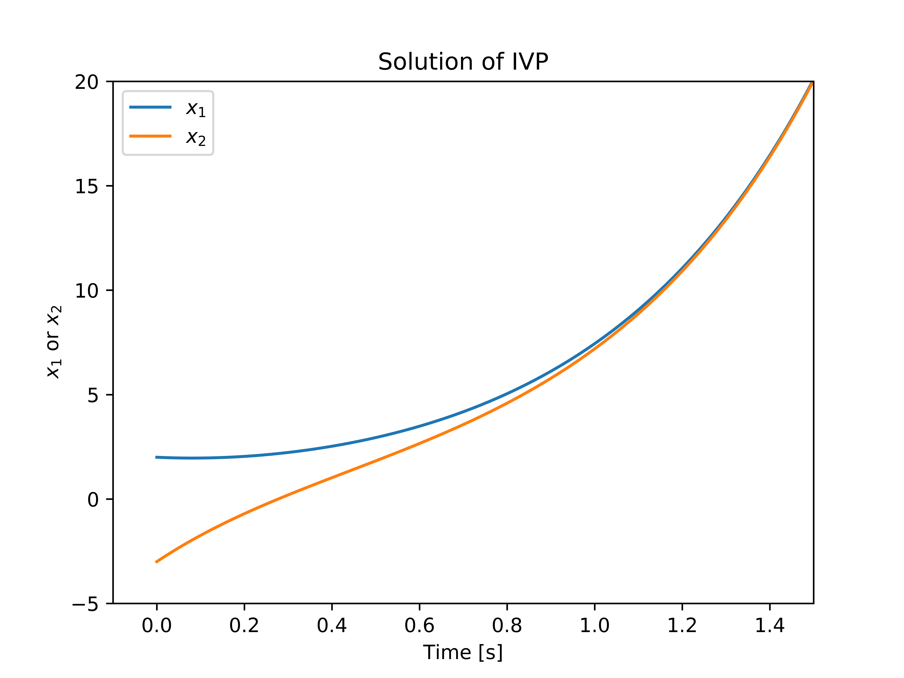
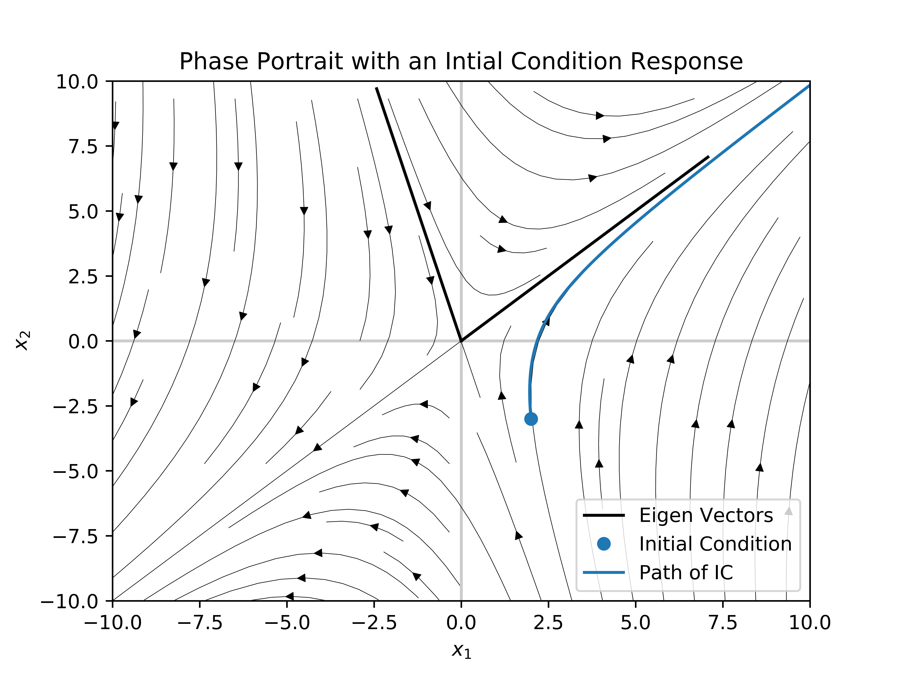

# Eigenvalues and Eigenvectos
Plots the solution and initial condition response (with stream lines) of a 2-dimensional eigenproblem.

# Math Behind It
The math behind this is not very complex and only requires some basic knowledge of differential equations and linear algebra. I wrote an explaination that can be found [here](https://drive.google.com/open?id=18-BsFYriYZPJ-sc3_Y66BBpB_YV0_x3A).

# Images
This code produces two images. The first is the solution and the second is the phase portrait with stream lines.

